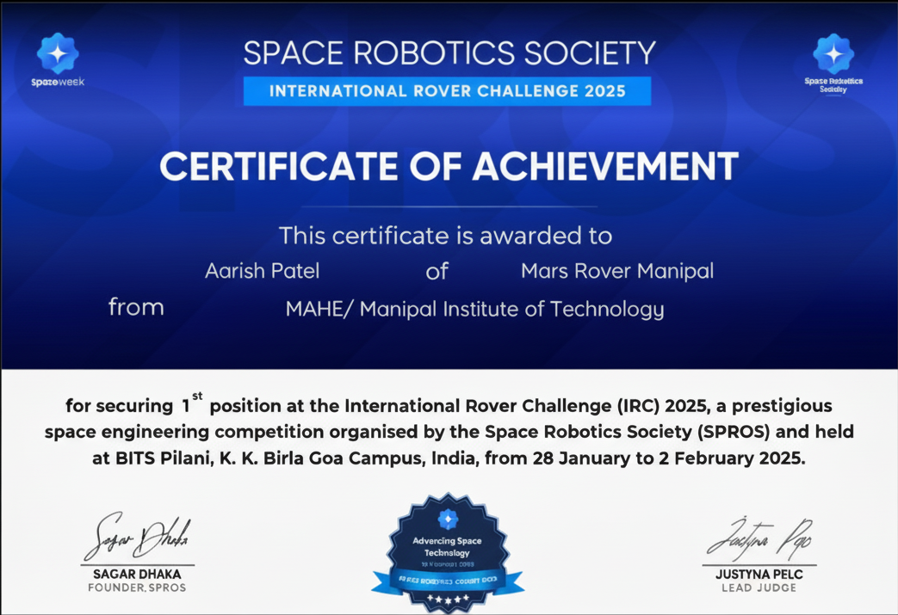
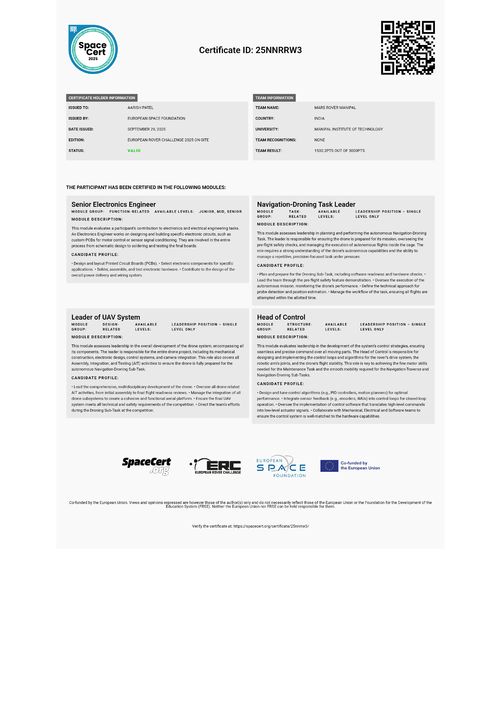

    

# 🚀 Mars Rover Manipal (MRM)

# MRM - Electronics and Control Systems Projects

This repository showcases my contributions to the Electronics and Control Systems team of **Mars Rover Manipal (MRM)**, Manipal Academy of Higher Education (MAHE)'s official rover design team. We are a research-focused team of undergraduate students dedicated to designing and building a functional Mars rover for global competitions.

My tenure was in 2025, during which the team achieved significant competitive success:

* **1st Place** in the **International Rover Challenge (IRC)**
* **10th Place** in the European Rover Challenge (ERC)

---

## 🛠️ My Role and Technical Contributions

As a core member of the Electronics and Control Systems team, my work spanned hardware design, embedded systems, power management, and software integration.

### Core Electronics & Hardware Design (Altium Designer)
* **Custom PCB Design:** Designed custom printed circuit boards (PCBs) in **Altium Designer** for motor drivers and sensor interfaces. Key focus areas included optimizing layout for signal integrity, robust power distribution, and manufacturability.
* **Power & Motor Control:** Contributed to the design and testing of power electronics systems, ensuring reliable and efficient motor control for the rover's locomotion.
* **Hardware Debugging:** Conducted extensive hardware testing and debugging using professional tools, including **oscilloscopes, multimeters, and signal analyzers.**

### Embedded Systems & Software Interfacing
* **Sensor Interfacing:** Developed **ESP32** firmware to interface various sensor modules for data acquisition, telemetry, and real-time control, ensuring reliable data communication across the system.
* **Embedded Control Design:** Engineered **real-time (RTOS)** embedded firmware to manage and automate rover operations, including the Robotic Arm and Drive System.
* **Robotic Arm Automation:** Developed an **Embedded C** application to interface with MoveIt2, translating planned paths into precise robotic arm motion using PID feedback control.
* **Drone Automation Script:** Developed a **MATLAB** script for drone flight control and automation, interfacing with a Python-based image detection library for object identification and autonomous navigation.

### System Integration & Collaboration
* Collaborated closely with the Mechanical, Software, and AI teams to ensure seamless electrical and communication integration across all rover subsystems.
---

## 🏆 Achievements and Verification

The following images confirm my involvement and the team's competitive standing:

| International Rover Challenge (IRC) Certificate | European Rover Challenge (ERC) Certificate |
| :---: | :---: |
|  |  |

***
